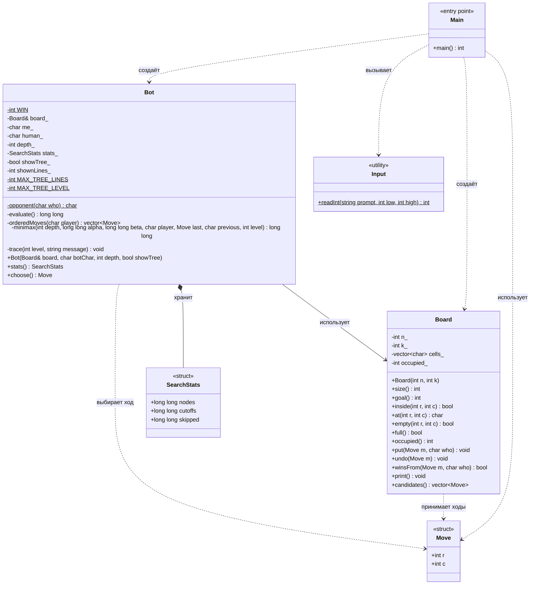

# Моделирование игры "Крестики-нолики"

## Нужно:
1. Реализовать необходимый набор классов для хранения информации о положении на игровом поле (поле – произвольного или «достаточно» большого размера)
2. Реализовать процесс игры бота против человека
3. Реализовать отсечение неэффективных ходов при переборе возможных вариантов (альфа-бета отсечение)

## Условие:
1. Количество крестиков или ноликов, необходимых для победы, - параметр игры
2. Отразить логику поиска, оценивания и выбора следующего хода
3. Проиллюстрировать отбрасывание неэффективных ходов из рассмотрения

## Как реализовано?
1. Поле проивзольного размера - Класс `Board`, размер `N x N`
2. Количество символов, необходимых для победы - параметр `k`
3. Игра бота против человека - через консоль
4. Поиск оптимального хода - алгоритм 
5. Отсечение неэффективных ходов - оптимизация 

## Структура программы
- Класс `Board` отвечает за:
    1. Хранение поля;
    2. Постановку и отмену ходов;
    3. Генерацию возможных ходов.
- Класс `Bot` отвечает за:
    1. Поиск лучшего хода;
    2. Оценивание позиций;
    3. Сортировку кандидатов;
    4. Альфа-бета отсечение.
- Структура `SearchStats` отвечает за:
    1. Число посещённых узлов;
    2. Отсечений;
    3. Пропущенных ходов.

